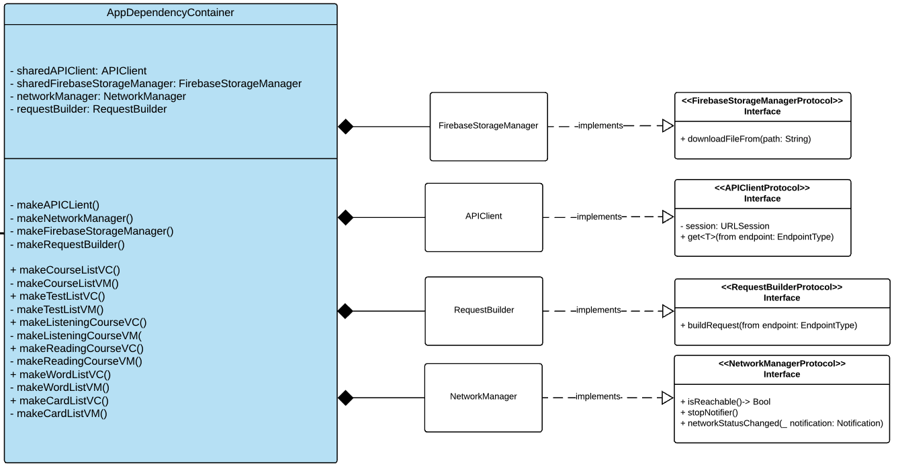
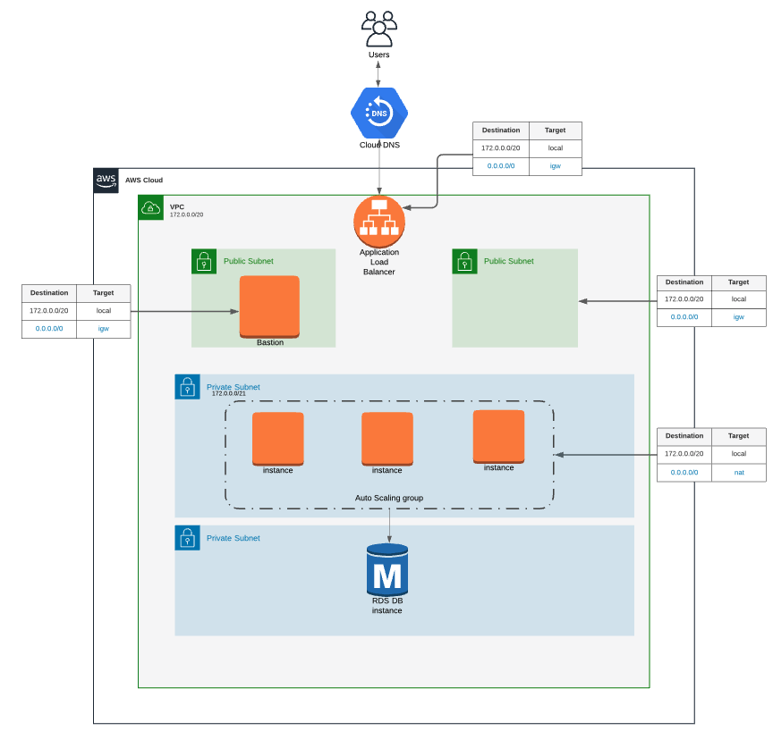

Welcome to StartDeutsch Project
================
Here I want to document my amazing journey of developing a full-stack project🙂.

# iOS Development
    

##  🏰 Architecture
The design pattern is MVVM. Reasons for chosing it:
1. It decouples UI and business logic, so it makes a code cleaner and flexible.
2. Since the project is relatively small, it is suitable for the size of project.
3. Allows to easily test data flow from remote and local sources.

The source code is [here](https://github.com/zhaziragaripolla/StartDeutsch/tree/master/StartDeutsch).
The detailed architecture is represented as UML diagram and could be found [here](https://app.lucidchart.com/documents/view/d28925f7-f7d8-4d7f-8a9d-4ae9cf3c04ae/0_0). Briefly, main roles holders are:

### [Dependency Container](https://github.com/zhaziragaripolla/StartDeutsch/blob/master/StartDeutsch/Supporting%20files/AppDependencyContainer.swift)
My intention was to build a maintanable, easy-to-understand, testable code. Well, how to achieve this goal? Firstly, I needed one place to manage the lifetime of dependencies to be injected to the View Models such as APIClient, Request Builder, CoreDataRepository etc. So, I found about Dependency Container while reading Advanced iOS App Architecture and here it is:


Looks good!

### [Coordinator](https://github.com/zhaziragaripolla/StartDeutsch/blob/master/StartDeutsch/Routing/AppCoordinator.swift)
Let's add a Coordinator to handle navigation flow and use dependency container to create view controllers where needed.

### [APIClient](https://github.com/zhaziragaripolla/StartDeutsch/blob/master/StartDeutsch/Networking/APIClient.swift)
The Network heart of the project. Responsible for fetching data from REST API and refreshing token. Teamed up with Combine.

# 📬 Back-end Development

As MVP and for the sake of time-saving, the Firebase was used a back-end. I found Cloud Firestore easy to configure. However, it required to add additional libraries to my iOS application, which increased project's building time significantly. But it was not an issue, because Firebase was meant to be a temporary solution and to be replaced by Django application in the future.  So, for first release of iOS app to AppStore, it did job very well.

Then, after release, I started to think about improving my back-end. And come up with this solution. We have now neat and simple REST API by help of Django REST framework.
```json
{
    "users": "https://localhost/api/v1/users/",
    "courses": "https://localhost/api/v1/courses/",
    "tests": "https://localhost/api/v1/tests/",
    "listening-questions": "https://localhost/api/v1/listening-questions/",
    "reading-questions": "https://localhost/api/v1/reading-questions/",
    "words": "https://localhost/api/v1/words/",
    "cards": "https://localhost/api/v1/cards/"
}
```
Wait a second! REST API needs to be secured! That's when [Djano OAuth Toolkit](https://django-oauth-toolkit.readthedocs.io/en/latest/index.html) library come in handy. It adds OAuth2.0 capabilities to our Django project. First, iOS client should be in the list of registered applications, meaning that we have now <strong>SECRET ID and SECRET KEY</strong>. Then, iOS application makes a call for a token to endpoint <code>/oauth2/token</code> using our credentials. If everything was done right, we got successful response:

```json
{
    "access_token": "PtK2oFO7sTGEWh7bGwRHkwi4uhHdwY",
    "expires_in": 36000,
    "token_type": "Bearer",
    "scope": "read"
}
```
Having this token allows iOS Client to make a secured call to our API. Isn't that great?🥳


# 🏘 AWS Infrastructure

Django application should be living somewhere🤔. Well, we can use Amazon Web Services(AWS) to host it. The infrastructure is following:


# 📚References to the learning resources I studied along the way

1. [Advanced iOS App Architecture](https://store.raywenderlich.com/products/advanced-ios-app-architecture)
2. [iOS Test-Driven Development by Tutorials](https://store.raywenderlich.com/products/ios-test-driven-development)
3. [Practical Combine](https://practicalcombine.com)
4. [Udemy. The complete guide to Combine](https://www.udemy.com/course/the-complete-guide-to-combine-framework-in-ios-using-swift/)
5. [Designing Data Intensive Applications](https://www.amazon.com/Designing-Data-Intensive-Applications-Reliable-Maintainable/dp/1449373321)
6. [Django Best Practices](https://learning.oreilly.com/library/view/django-design-patterns/9781783986644/)
7. [Coursera. AWS Fundamentals: Going Cloud-Native](https://www.coursera.org/learn/aws-fundamentals-going-cloud-native)
8. [Learning Amazon Web Services (AWS)](https://learning.oreilly.com/library/view/learning-amazon-web/9780135301104/)
